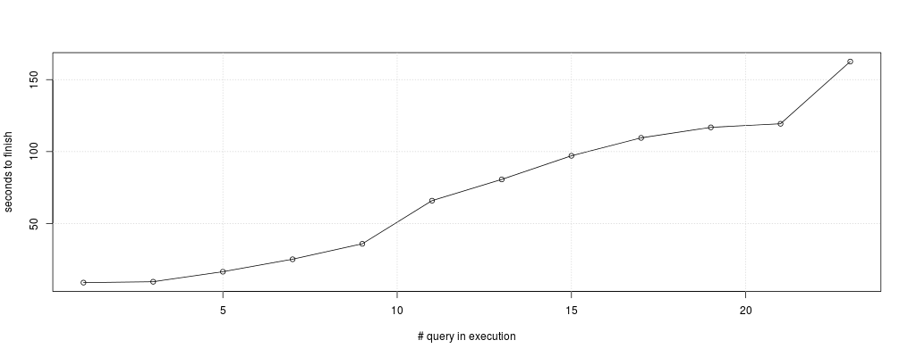
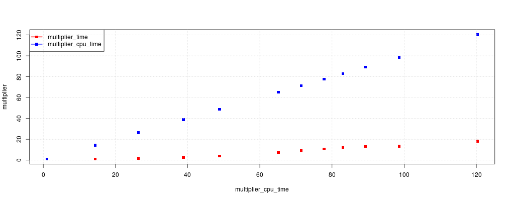

Cloudera Impala timing benchmark
========================================================
author: Michele Giusto
date: 2014-11-23

Introduction
========================================================
Aim of the experiment is to understand how execution time of various SQL queries executed with Cloudra Impala changes when more queries are executed in parallel. 

To do so, various tests have been executed. In each one, queries were randomnly reordered and then at each iteration executed increasing the level of parallelism (by executing more queries).

Example dataset
========================================================
For each test, the dataset is composed of the execution time of each query, plus total RAM usage, CPU time and HDFS file read. Here is reported an example of the dataset:


```
  nQueries query_50 query_25 total_cpu_time
1        1     8.99       NA            8.1
2        3     9.60    64.07          116.5
3        5    16.55    91.65          213.5
4        7    25.21   125.36          314.6
5        9    35.94   153.13          395.7
```

Time plot
========================================================
Time plot shows how execution time changes when more queries are added. The first point is the first execution of the selected query, then the other points make reference to the followings iteration.


Multiplier plot
========================================================
Multiplier plot shows how the selected variable (aggregate peak/HDFS byte read/cpu time) increase in the different iteration. This is compared to the increase in the execution time of the selected queries. 

